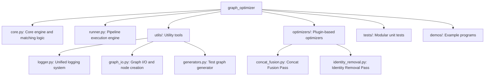

# Graph Optimizer

Graph Optimizer is an offline optimization framework for TensorFlow `GraphDef` based on pattern matching. It provides a flexible and efficient API for rapidly developing and executing various graph optimization passes (e.g., operator fusion, redundant node removal).

## Core Features

- **Powerful and Flexible Pattern Matching**: Supports matching of operator types (Op), wildcards (Any), variadic inputs (Variadic), and commutative operators (CommutativeOp).
- **Efficient Pipeline Execution**: Supports multi-level optimizations (Optimization Levels) and failure rollback. If a pass fails, the system automatically restores the graph state.
- **O(1) Matching Performance**: Built-in operator indexing (Op-type Indexing) rapidly locates potential matching nodes, significantly reducing optimization time.
- **Automatic Resource Management**:
  - **Dead Node Pruning**: Automatically removes isolated nodes generated after optimization.
  - **Dependency Preservation**: Automatically maintains and transfers original Control Dependencies during graph rewriting.
- **Modular Design**: Core engine, optimizer plugins, utilities, and testing framework are fully decoupled and easy to extend.

## Project Structure



## Quick Start

### 1. Run System Tests

The project provides a self-contained regression test script to verify all functions:

```bash
sh run_test.sh
```

### 2. Run Demo

Demonstrates how to automatically fuse multi-level nested Concat operators:

```bash
export PYTHONPATH=$PYTHONPATH:.
python3 demos/run_demo.py
```

## Developing Custom Passes

You can easily create custom optimizers by inheriting from `PatternRewritePass` and using `PassRegistry`:

```python
from graph_optimizer import Op, create_node, PassRegistry, PatternRewritePass

@PassRegistry.register("my_optimization", opt_level=1, priority=10)
class MyOptimizationPass(PatternRewritePass):
    def __init__(self):
        # Define the pattern to match
        pattern = Op("Identity", Op("Const", alias="value"), alias="root")
        super().__init__(pattern, self._rewrite_logic, name="MyOpt")

    def _rewrite_logic(self, match, optimizer):
        # Implement rewrite logic
        root = match.matched_nodes["root"]
        # Return new node list
        return [create_node("NoOp", root.name)]
```

## Optimization Management: Level and Priority

The framework manages all optimization rules via `PassRegistry`. When registering a Pass, there are two core parameters:

- **`opt_level`**:

  - Used categorize optimization passes. Generally:
    - **Level 1**: High-safety optimizations (e.g., removing redundant Identity nodes).
    - **Level 2**: More aggressive optimizations (e.g., fusing multiple Concat operators).
  - When running `OptimizationPipeline`, higher levels include all passes from lower levels.

- **`priority`**:
  - Decides the execution order of passes within the same level.
  - **Lower values execute earlier**.
  - This is critical when some passes depend on the results of others.

## Key Modules

- **`core.py`**: Core engine, defines the `GraphOptimizer` class and the pattern matching DSL.
- **`runner.py`**: Provides the `OptimizationPipeline` class for sequencing multiple passes.
- **`utils/`**: Utility tools for logging, graph I/O, and test generation.
- **`optimizers/`**: Contains validated common optimization passes.
- **`run_test.sh`**: Integrated regression test script.
