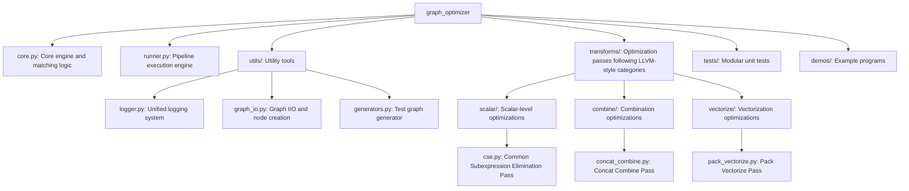

# Graph Optimizer

Graph Optimizer is an offline optimization framework for TensorFlow `GraphDef` based on pattern matching. It provides a flexible and efficient API for rapidly developing and executing various graph optimization passes (e.g., operator fusion, redundant node removal).

## Core Features

- **Powerful and Flexible Pattern Matching**: Supports matching of operator types (Op), wildcards (Any), variadic inputs (Variadic), and commutative operators (CommutativeOp).
- **Efficient Pipeline Execution**: Supports multi-level optimizations (Optimization Levels) and failure rollback. If a pass fails, the system automatically restores the graph state.
- **O(1) Matching Performance**: Built-in operator indexing (Op-type Indexing) rapidly locates potential matching nodes, significantly reducing optimization time.
- **Automatic Resource Management**:
  - **Dead Node Pruning**: Automatically removes isolated nodes generated after optimization.
  - **Dependency Preservation**: Automatically maintains and transfers original Control Dependencies during graph rewriting.
  - **Common Subexpression Elimination (CSE)**: Eliminates duplicate nodes with identical operations, inputs, and attributes (including Const nodes with same value and dtype).
  - **Cleanup Between Passes**: Optional feature to run cleanup passes (CSE, constant folding, etc.) between each main optimization pass for maximum optimization effect.
- **Modular Design**: Core engine, optimizer plugins, utilities, and testing framework are fully decoupled and easy to extend.

## Project Structure



## Quick Start

### 1. Run System Tests

The project provides a self-contained regression test script to verify all functions:

```bash
sh run_test.sh
```

### 2. Run Demo

Demonstrates how to automatically fuse multi-level nested Concat operators:

```bash
export PYTHONPATH=$PYTHONPATH:.
python3 demos/run_demo.py
```

## Developing Custom Passes

You can easily create custom optimizers by inheriting from `PatternRewritePass` and using `PassRegistry`:

```python
from graph_optimizer.core import Op, create_node, PassRegistry, PatternRewritePass

@PassRegistry.register("my_optimization", opt_level=1, priority=10)
class MyOptimizationPass(PatternRewritePass):
    def __init__(self):
        # Define the pattern to match
        pattern = Op("Identity", Op("Const", alias="value"), alias="root")
        super().__init__(pattern, self._rewrite_logic, name="MyOpt")

    def _rewrite_logic(self, match, optimizer):
        # Implement rewrite logic
        root = match.matched_nodes["root"]
        # Return new node list
        return [create_node("NoOp", root.name)]
```

## Advanced Features

### Cleanup Between Passes

Enable automatic cleanup (CSE, constant folding, etc.) between each main optimization pass:

```python
from graph_optimizer import OptimizationPipeline

pipeline = OptimizationPipeline(
    input_graph="input.pb",
    output_graph="output.pb",
    level=2,
    run_cleanup_between_passes=True,  # Enable cleanup
    cleanup_passes=['common_subexpression_elimination'],  # Optional: specify cleanup passes
)
pipeline.run()
```

This feature can significantly improve optimization results (e.g., from 19.9% to 47.8% node reduction in complex graphs) by discovering cascading optimization opportunities.

## Log Statistics

The optimizer provides detailed per-pass and overall statistics to help analyze performance and effectiveness:

- **Per-pass metrics**: Iterations executed, nodes modified, node count change, elapsed time.
- **Overall summary**: Total passes run, total time, initial/final node counts, reduction percentage.

Example output:
```
CSE                              12      770    2603 -> 1833   0.081s
ConcatCombine                     2        1    1765 -> 1763   0.010s
PackVectorize                    10      531    1763 -> 1284   0.114s
Total passes executed: 4
Total time: 0.266s
Nodes: 2603 -> 1284 (removed: 1319)
Reduction: 50.7%
```
These logs are written to `outputs/run_<timestamp>/optimization.log` and printed to stdout when running the pipeline.

## Optimization Management: Level and Priority

The framework manages all optimization rules via `PassRegistry`. When registering a Pass, there are two core parameters:

- **`opt_level`**:
  
  - Used categorize optimization passes. Generally:
    - **Level 1**: High-safety optimizations (e.g., `algebraic_simplify`).
    - **Level 2**: More aggressive optimizations (e.g., `concat_combine`, `pack_vectorize`).
  - When running `OptimizationPipeline`, higher levels include all passes from lower levels.

- **`priority`**:
  - Decides the execution order of passes within the same level.
  - **Lower values execute earlier**.
  - This is critical when some passes depend on the results of others.

### Registered Passes

| Pass Name | Category | Description |
|-----------|----------|-------------|

| `cse` | scalar | Eliminates duplicate subexpressions |
| `algebraic_simplify` | scalar | Performs algebraic simplifications including identity folding, arithmetic/logical/comparison identities, trigonometric simplifications, rounding, sign, cast simplifications, and more. |
| `concat_combine` | combine | Fuses consecutive Concat operations |
| `pack_vectorize` | vectorize | Hoists Pack operations for batch execution |

Pass names use underscores (LLVM-style) instead of hyphens.

## Key Modules

- **`core.py`**: Core engine, defines the `GraphOptimizer` class and the pattern matching DSL.
- **`runner.py`**: Provides the `OptimizationPipeline` class for sequencing multiple passes.
- **`utils/`**: Utility tools for logging, graph I/O, and test generation.
- **`transforms/`**: Contains validated common optimization passes, categorized as:
  - `scalar/` – scalar-level optimizations (e.g., algebraic simplification, CSE)
  - `combine/` – combination optimizations (e.g., concat fusion)
  - `vectorize/` – vectorization optimizations (e.g., pack hoisting)
- **`run_test.sh`**: Integrated regression test script.
