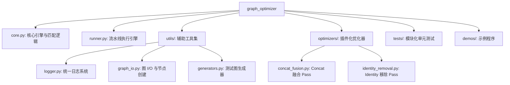

# Graph Optimizer

Graph Optimizer 是一个基于模式匹配的 TensorFlow `GraphDef` 离线优化框架。它提供了一套灵活且高效的 API，用于快速开发和执行各种图优化 Pass（如算子融合、冗余节点移除等）。

## 核心特性

- **强大且灵活的模式匹配**：支持算子类型（Op）、通配符（Any）、变长输入（Variadic）以及交换律算子（CommutativeOp）的匹配。
- **高效的流水线执行**：支持多级优化（Optimization Levels）和故障回滚。如果某个 Pass 执行失败，系统会自动恢复图状态。
- **O(1) 匹配性能**：内置算子索引（Op-type Indexing），能够快速定位潜在的匹配节点，大幅缩短优化时间。
- **自动资源管理**：
  - **死节点清理**：自动移除优化后产生的孤立节点。
  - **依赖保持**：在图重写过程中，自动保持并转移原有的控制依赖（Control Dependencies）。
- **模块化设计**：核心引擎、优化器插件、工具集和测试框架完全解耦，易于扩展。

## 项目结构



## 快速开始

### 1. 运行系统测试

项目提供了一个自包含的回归测试脚本，可以一键验证所有功能：

```bash
sh run_test.sh
```

### 2. 运行演示程序

展示如何自动融合多层级嵌套的 Concat 算子：

```bash
export PYTHONPATH=$PYTHONPATH:.
python3 demos/run_demo.py
```

## 开发自定义 Pass

你可以通过继承 `PatternRewritePass` 并使用 `PassRegistry` 轻松创建自定义优化器：

```python
from graph_optimizer import Op, create_node, PassRegistry, PatternRewritePass

@PassRegistry.register("my_optimization", opt_level=1, priority=10)
class MyOptimizationPass(PatternRewritePass):
    def __init__(self):
        # 定义要匹配的模式
        pattern = Op("Identity", Op("Const", alias="value"), alias="root")
        super().__init__(pattern, self._rewrite_logic, name="MyOpt")

    def _rewrite_logic(self, match, optimizer):
        # 实现重写逻辑
        root = match.matched_nodes["root"]
        # 返回新的节点列表
        return [create_node("NoOp", root.name)]
```

## 优化管理：Level 与 Priority

框架通过 `PassRegistry` 统一管理所有优化规则。在注册 Pass 时，有两个核心参数：

- **`opt_level` (优化等级)**：

  - 用于对优化 Pass 进行分类。通常情况下：
    - **Level 1**：极高安全性的优化（如移除无意义的 Identity 节点）。
    - **Level 2**：更积极的优化（如多个 Concat 算子融合）。
  - 执行 `OptimizationPipeline` 时，指定的等级越高，包含的优化 Pass 越多（包含所有小于或等于该等级的 Pass）。

- **`priority` (优先级)**：
  - 决定了同一等级下 Pass 的执行顺序。
  - **数值越小，执行越早**。
  - 某些 Pass 可能依赖于其他 Pass 的执行结果，此时优先级就显得尤为重要。

## 关键模块详述

- **`core.py`**：核心引擎，定义了 `GraphOptimizer` 类和基础模式匹配语言。
- **`runner.py`**：提供 `OptimizationPipeline` 类，用于串联多个 Pass 执行。
- **`utils/`**：底层工具集，包含日志、图读写和测试数据生成。
- **`optimizers/`**：存放经过验证的常用优化 Pass。
- **`run_test.sh`**：集成回归测试脚本。
